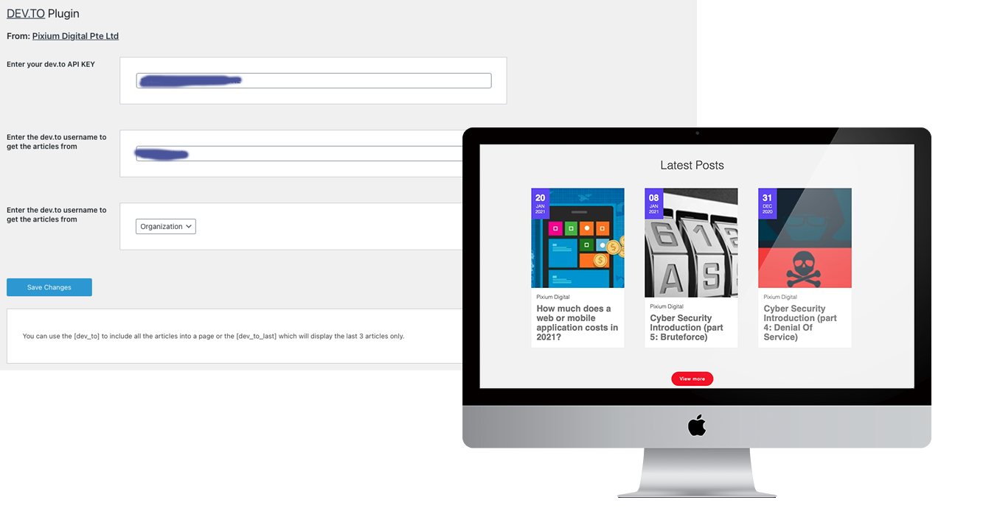

# Introduction

Wordpress plugin to connect to the API and display news onto your website

# Instalation

Download and zip the folder. Then go to Plugin > Add New Plugin > Upload to upload the zip file.

# Settings

Once setup go to your Wordpress Menu > Settings > DevTo Settings.

Fill in the info

API KEY: You API key generated in dev.to
username: The username of the organization (if you select organization)
type: Organization or Me if you only want to display the news created by the owner of the key.

# Usage

You can integrate by using the shortcode
```
[dev_to]
```
to display all the news in rows of 3

or

```
[dev_to_last]
```
to display only 1 row of your last 3 posts.